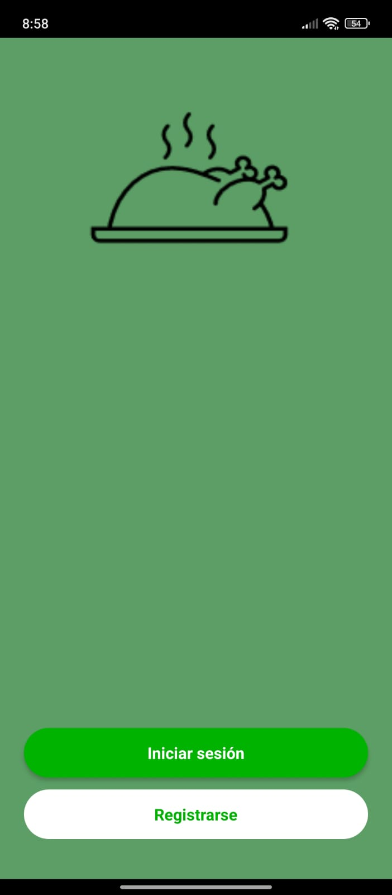
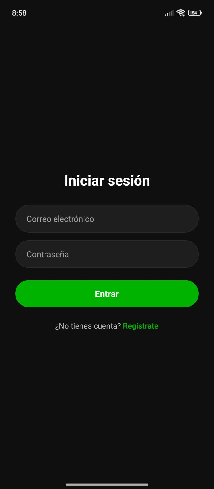

# Recetario - App de Gestión de Recetas

## 1. Identificación del Proyecto

# Recetario - App de Gestión de Recetas

## 1. Identificación del Proyecto

- **Nombre de la App:** Recetario
- **Descripción:** Aplicación móvil para explorar, crear y gestionar recetas de cocina.
- **Periodo/Fecha:** Octubre 2025
- **URL del Repositorio:** `https://github.com/marianaquirinoayala80-coder/recetario.git`


## 2. Descripción del Proyecto

RecetarioApp es una aplicación desarrollada con React Native y Expo que permite a los usuarios explorar recetas, ver detalles completos, crear sus propias recetas y organizarlas por categorías. La app ofrece una navegación simple y una interfaz moderna.

### Características Principales

- 📖 **Listado de Recetas**: Vista principal con tarjetas de recetas
- 🧑‍🍳 **Detalles de Receta**: Ingredientes, pasos y tiempo de preparación
- ✍️ **Creación y Edición**: Formularios para agregar o modificar recetas
- 🔎 **Búsqueda**: Filtro por nombre o ingredientes
- ⭐ **Favoritos**: Marca recetas para acceso rápido
- 🧭 **Navegación Intuitiva**: Flujo entre pantallas con botón de regreso

### Funcionalidades Implementadas (iniciales)

- Estructura de navegación base (Stacks y Bottom Tabs)
- Pantallas de autenticación, inicio, favoritos y ajustes
- Componentes UI con Gluestack y NativeWind

## 3. Tecnologías y Versiones Utilizadas

### Stack Tecnológico

- **Expo:** ^54.0.8
- **React:** 19.1.0
- **React Native:** 0.81.4
- **React Navigation (core):** ^7.1.17
- **React Navigation Native Stack:** ^7.3.26
- **React Native Screens:** ^4.16.0
- **React Native Safe Area Context:** ^5.6.1
- **UI/Estilos:** `@gluestack-ui/*`, `nativewind`, `tailwindcss`

### Herramientas de Desarrollo Requeridas

- **Node.js:** 18.17.0 o superior
- **NPM:** 9.0.0+ o **Yarn:** 1.22.19+
- **Expo CLI:** 6.3.0+
- **Android Studio:** 2022.3+ con Android SDK 33+ o app Expo Go

### Verificación de Entorno

```bash
npx expo doctor
```

## 4. Estructura del Proyecto

```
recetario/
├── App.js
├── app.json
├── package.json
├── index.js
├── assets/
│   ├── adaptive-icon.png
│   ├── favicon.png
│   ├── icon.png
│   └── splash-icon.png
└── src/
    ├── components/
    │   └── Navigation/
    │       ├── IconBack.js
    │       └── index.js
    ├── navigations/
    │   ├── AppNavigation.js
    │   ├── BottomTabNavigation/
    │   │   └── BottomTabNavigation.js
    │   ├── HandlerNavigation.js
    │   └── stacks/
    │       ├── AuthNavigation.js
    │       ├── RecipesNavigation.js
    │       └── SettingsNavigation.js
    ├── screens/
    │   ├── Auth/
    │   │   ├── AuthStartScreen.js
    │   │   ├── LoginScreen.js
    │   │   └── RegisterScreen.js
    │   ├── Favorites/
    │   │   └── FavoriteScreen.js
    │   ├── Global/
    │   │   ├── CameraScreen.js
    │   │   ├── ImageFullScreen.js
    │   │   └── UserProfileScreen.js
    │   ├── Home/
    │   │   └── HomeScreen.js
    │   └── Settings/
    │       └── SettingsScreen.js
    └── utils/
        ├── index.js
        └── screens.js
```

### Arquitectura de la Aplicación

- `App.js`: Componente raíz con `NavigationContainer`
- `navigations/*`: Definición de Stacks y Tabs
- `screens/*`: Pantallas por módulo (Auth, Home, Favorites, Settings, Global)
- `utils/screens.js`: Constantes de nombres de pantallas

## 5. Instalación y Configuración

### Instalación de Dependencias

```bash
# Clonar el repositorio
git clone https://github.com/marianaquirinoayala80-coder/recetario.git
cd recetario

# Instalar dependencias
npm install
# o
yarn
```

### Dependencias del Proyecto (principales)

| Dependencia | Versión | Propósito |
| --- | --- | --- |
| @react-navigation/native | ^7.1.17 | Core de navegación |
| @react-navigation/native-stack | ^7.3.26 | Stack navigator |
| react-native-screens | ^4.16.0 | Optimizaciones nativas de navegación |
| react-native-safe-area-context | ^5.6.1 | Manejo de áreas seguras |
| expo-status-bar | ~3.0.8 | Barra de estado |
| expo | ^54.0.8 | Framework de desarrollo |
| react | 19.1.0 | Biblioteca UI |
| react-native | 0.81.4 | Desarrollo móvil |
| nativewind / tailwindcss | ^4.1.23 / ^3.4.17 | Estilos utilitarios |

### Verificar instalación

```bash
npm list --depth=0
```

## 6. Ejecución de la Aplicación

### Scripts Disponibles

```bash
# Iniciar servidor de desarrollo
npm start

# Ejecutar en Android (emulador/dispositivo)
npm run android

# Ejecutar en iOS (solo macOS)
npm run ios

# Ejecutar en web
npm run web
```

También puedes usar:

```bash
npx expo start
npx expo start --android
npx expo start --ios
npx expo start --web
```

### Primera Ejecución

1. Instalar dependencias: `npm install`
2. Iniciar el servidor: `npm start`
3. Conectar dispositivo:
   - Android: Expo Go o emulador
   - iOS: Expo Go o simulador (macOS)
   - Web: se abre en navegador

### Notas de Entorno

- El emulador Android debe estar iniciado antes de `npm run android`
- En redes restrictivas, usa: `npx expo start --tunnel`

## 7. Funcionalidades de la Aplicación

### Pantalla Principal (Home)

- Lista de recetas en tarjetas con imagen, título y tiempo estimado
- Tap para navegar a detalle de receta
- Búsqueda por nombre o ingrediente (si está habilitada)

### Pantalla de Detalles

- Ingredientes, pasos, porciones y dificultad
- Botones: "Editar", "Agregar a Favoritos" (si procede)

### Módulos Adicionales

- Autenticación (Login/Registro)
- Favoritos
- Ajustes y perfil de usuario






## 8. Desarrollo y Extensión

### Próximas Funcionalidades Sugeridas

- Persistencia local con AsyncStorage (favoritos y recetas propias)
- Sincronización/backup en la nube
- Búsqueda avanzada y categorías (postres, sopas, etc.)
- Compartir recetas
- Integración con cámara para fotos de recetas

### Estructura para Nuevas Pantallas

```jsx
export function NewScreen() {
  return (
    <View style={styles.container}>
      {/* Contenido de la pantalla */}
    </View>
  );
}
```

### Agregar Nuevas Rutas

1. Actualizar `src/utils/screens.js` con nuevas constantes
2. Agregar Screen en `src/navigations/*`
3. Crear componente en `src/screens/`

## 9. Troubleshooting

| Problema | Solución |
| --- | --- |
| Error de instalación | `npm install --legacy-peer-deps` |
| Metro cache corrupto | `npx expo start --clear` |
| Puerto ocupado | `npx expo start --port 8082` |
| Dependencias desactualizadas | `npx expo doctor` |

### Comandos Útiles

```bash
# Verificar entorno
npx expo doctor

# Limpiar cache
npx expo start --clear

# Reinstalar dependencias (npm)
rm -rf node_modules package-lock.json && npm install
```

## 10. Recursos y Documentación

- Expo (Documentación)
- React Navigation
- React Native Docs
- Gluestack UI / NativeWind
- Referencia: [Movies Explorer - plantilla del profesor](https://github.com/l3onet/movies-explorer-app)

---

**Desarrollado por:** Mariana Quirino Ayala
**Última actualización:** 9 de octubre 2025  
**Versión:** 1.0.0