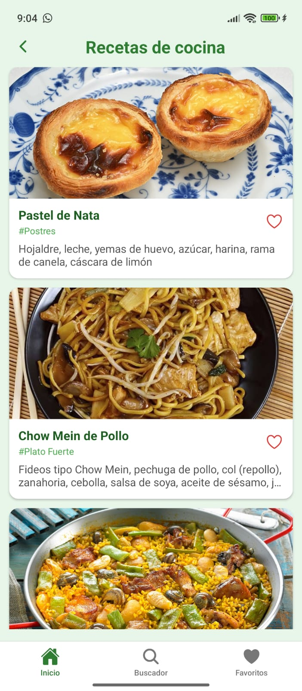
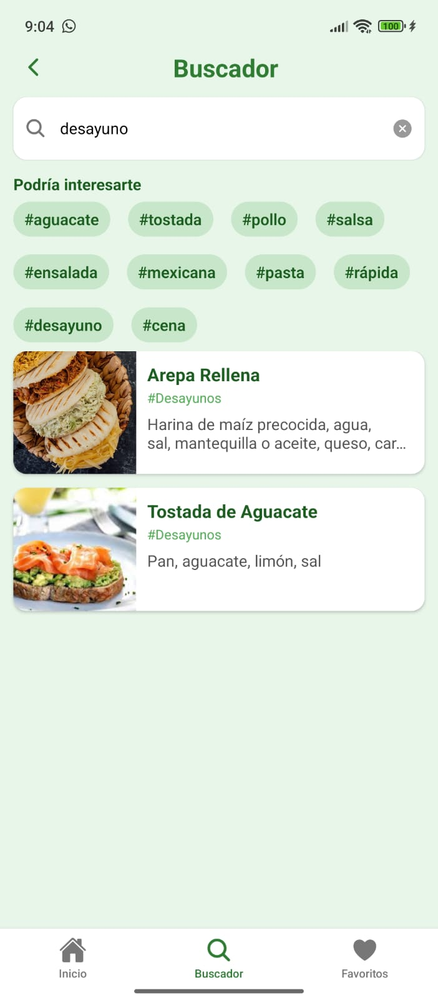
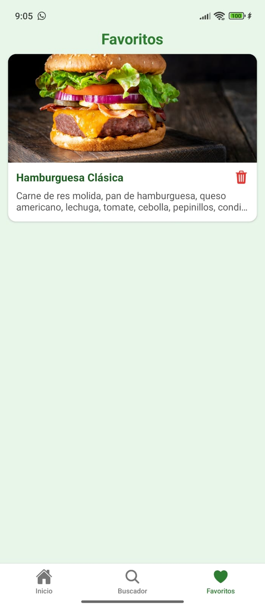
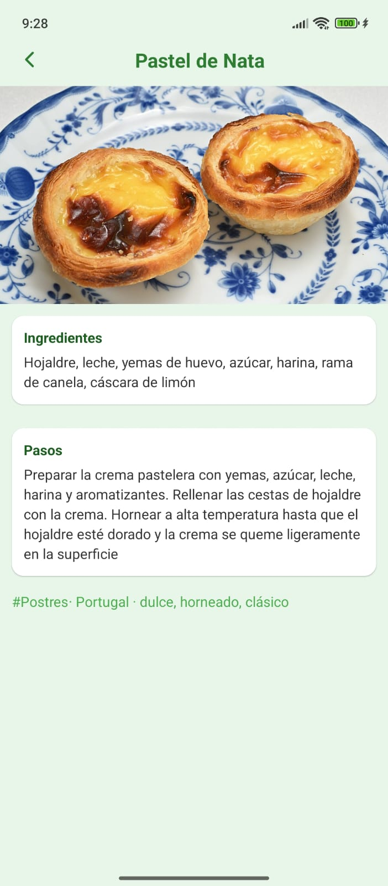

# Recetario - App de Gestión de Recetas

## 1. Identificación del Proyecto

- **Nombre de la App:** Recetario
- **Descripción:** Aplicación móvil para explorar, crear y gestionar recetas de cocina con búsqueda avanzada y sistema de favoritos.
- **Periodo/Fecha:** Octubre 2025
- **URL del Repositorio:** `https://github.com/marianaquirinoayala80-coder/recetario.git`

## 2. Descripción del Proyecto

Recetario es una aplicación desarrollada con React Native y Expo que permite a los usuarios explorar recetas desde una API externa, ver detalles completos, buscar por diferentes criterios y gestionar sus recetas favoritas. La app ofrece una navegación intuitiva con pestañas inferiores y una interfaz moderna con diseño consistente.

### Características Principales

- 🏠 **Pantalla de Bienvenida**: Pantalla inicial con logo y botón de entrada
- 📖 **Listado de Recetas**: Vista principal con tarjetas de recetas, imágenes y categorías
- 🔍 **Búsqueda Avanzada**: Búsqueda por título, ingredientes, país o categoría con sugerencias
- ⭐ **Sistema de Favoritos**: Guardar y gestionar recetas favoritas con persistencia local
- 🧑‍🍳 **Detalles de Receta**: Vista completa con ingredientes, pasos, categoría y tags
- 🧭 **Navegación Intuitiva**: Bottom tabs con navegación entre pantallas
- 💾 **Persistencia Local**: Almacenamiento de favoritos con AsyncStorage

### Funcionalidades Implementadas

- ✅ Estructura de navegación con Stack Navigator y Bottom Tabs
- ✅ Integración con API externa para obtener recetas
- ✅ Búsqueda en tiempo real con sugerencias predefinidas
- ✅ Sistema de favoritos con persistencia local (AsyncStorage)
- ✅ Pantalla de detalles con información completa de recetas
- ✅ Pull-to-refresh en listado de recetas
- ✅ Navegación fluida entre pantallas con botones de regreso
- ✅ Diseño consistente con tema verde y UI moderna

## 3. Tecnologías y Versiones Utilizadas

### Stack Tecnológico

- **Expo:** ^54.0.13
- **React:** 19.1.0
- **React Native:** 0.81.4
- **React Navigation:**
  - `@react-navigation/native`: ^7.1.18
  - `@react-navigation/native-stack`: ^7.3.28
  - `@react-navigation/bottom-tabs`: ^7.4.9
- **React Native Screens:** ~4.16.0
- **React Native Safe Area Context:** ~5.6.0
- **React Native Gesture Handler:** ~2.28.0
- **AsyncStorage:** `@react-native-async-storage/async-storage`: ^2.2.0
- **UI/Estilos:** 
  - `nativewind`: ^4.1.23
  - `tailwindcss`: ^3.4.17
  - `@gluestack-ui/*`: ^3.0.0
  - `@expo/vector-icons`: ^15.0.3
- **Expo Image Picker:** ~17.0.8

### Herramientas de Desarrollo Requeridas

- **Node.js:** 18.17.0 o superior
- **NPM:** 9.0.0+ o **Yarn:** 1.22.19+
- **Expo CLI:** 6.3.0+
- **Android Studio:** 2022.3+ con Android SDK 33+ o app Expo Go
- **iOS Simulator** (solo macOS) o app Expo Go

### Verificación de Entorno

```bash
npx expo doctor
```

## 4. Estructura del Proyecto

```
recetario/
├── App.js                      # Componente raíz con NavigationContainer
├── app.json                    # Configuración de Expo
├── package.json                # Dependencias del proyecto
├── index.js                    # Punto de entrada
├── babel.config.js             # Configuración de Babel
├── metro.config.js             # Configuración de Metro bundler
├── tailwind.config.js          # Configuración de Tailwind CSS
├── global.css                  # Estilos globales
├── assets/                     # Recursos estáticos
│   ├── adaptive-icon.png
│   ├── favicon.png
│   ├── icon.png
│   └── splash-icon.png
├── docs/                       # Documentación visual
│   ├── PantallaBienvenida.jpg
│   ├── PantallaInicio.jpg
│   ├── PantallaBuscador.jpg
│   ├── PantallaFavoritos.jpg
│   └── PantallaDetalles.jpg
└── src/
    ├── api/
    │   └── api.js              # Funciones de API (fetchRecipes, searchRecipes)
    ├── assets/
    │   └── logo.png            # Logo de la aplicación
    ├── components/
    │   └── RecipeCard.js      # Componente de tarjeta de receta
    ├── constants.js            # Constantes (API_URL)
    ├── navigations/
    │   ├── HandlerNavigation.js        # Stack principal (Welcome, Main, RecipeDetail)
    │   └── BottomTabsNavigation.js     # Tabs inferiores (Inicio, Buscador, Favoritos)
    ├── screens/
    │   ├── Welcome/
    │   │   └── WelcomeScreen.js        # Pantalla de bienvenida
    │   ├── Home/
    │   │   ├── HomeScreen.js           # Listado principal de recetas
    │   │   └── RecipeDetail.js         # Detalle completo de receta
    │   ├── Search/
    │   │   └── SearchScreen.js         # Búsqueda de recetas
    │   └── Favorite/
    │       └── FavoriteScreen.js       # Lista de recetas favoritas
    └── storage/
        └── favorites.js        # Utilidades de almacenamiento (si aplica)
```

### Arquitectura de la Aplicación

- **App.js**: Componente raíz que envuelve la app con `NavigationContainer`
- **HandlerNavigation**: Stack Navigator principal que maneja:
  - `Welcome`: Pantalla inicial
  - `Main`: Bottom Tabs Navigator
  - `RecipeDetail`: Pantalla de detalles
- **BottomTabsNavigation**: Navigator con tres pestañas:
  - `Inicio`: Lista de recetas
  - `Buscador`: Búsqueda de recetas
  - `Favoritos`: Recetas guardadas
- **API**: Módulo centralizado para llamadas a la API externa
- **Storage**: Persistencia local con AsyncStorage para favoritos

## 5. Instalación y Configuración

### Instalación de Dependencias

```bash
# Clonar el repositorio
git clone https://github.com/marianaquirinoayala80-coder/recetario.git
cd recetario

# Instalar dependencias
npm install
# o
yarn
```

### Configuración de la API

La aplicación requiere una API externa para obtener las recetas. Configura la URL en `src/constants.js`:

```javascript
export const API_URL = "http://TU_IP:4000/api";
```

**Nota:** Asegúrate de actualizar la IP con la dirección de tu servidor API. Si estás probando en un dispositivo físico, usa la IP de tu red local.

### Dependencias del Proyecto (principales)

| Dependencia | Versión | Propósito |
| --- | --- | --- |
| @react-navigation/native | ^7.1.18 | Core de navegación |
| @react-navigation/native-stack | ^7.3.28 | Stack navigator |
| @react-navigation/bottom-tabs | ^7.4.9 | Bottom tabs navigator |
| react-native-screens | ~4.16.0 | Optimizaciones nativas de navegación |
| react-native-safe-area-context | ~5.6.0 | Manejo de áreas seguras |
| @react-native-async-storage/async-storage | ^2.2.0 | Almacenamiento local |
| expo | ^54.0.13 | Framework de desarrollo |
| react | 19.1.0 | Biblioteca UI |
| react-native | 0.81.4 | Desarrollo móvil |
| nativewind | ^4.1.23 | Estilos utilitarios con Tailwind |
| tailwindcss | ^3.4.17 | Framework CSS |
| @expo/vector-icons | ^15.0.3 | Iconos vectoriales |

### Verificar instalación

```bash
npm list --depth=0
```

## 6. Ejecución de la Aplicación

### Scripts Disponibles

```bash
# Iniciar servidor de desarrollo
npm start

# Ejecutar en Android (emulador/dispositivo)
npm run android

# Ejecutar en iOS (solo macOS)
npm run ios

# Ejecutar en web
npm run web
```

También puedes usar:

```bash
npx expo start
npx expo start --android
npx expo start --ios
npx expo start --web
```

### Primera Ejecución

1. Instalar dependencias: `npm install`
2. Configurar la URL de la API en `src/constants.js`
3. Iniciar el servidor: `npm start`
4. Conectar dispositivo:
   - **Android**: Expo Go o emulador
   - **iOS**: Expo Go o simulador (macOS)
   - **Web**: se abre automáticamente en el navegador

### Notas de Entorno

- El emulador Android debe estar iniciado antes de `npm run android`
- En redes restrictivas, usa: `npx expo start --tunnel`
- Para desarrollo en dispositivo físico, asegúrate de que el dispositivo y la computadora estén en la misma red WiFi
- La API debe estar accesible desde la red local

## 7. Funcionalidades de la Aplicación

### Pantalla de Bienvenida (Welcome)

- Pantalla inicial con logo y descripción de la aplicación
- Botón "Entrar" que navega a la pantalla principal
- Diseño limpio y acogedor


### Pantalla Principal (Home/Inicio)

- **Lista de Recetas**: Tarjetas con imagen, título, categoría e ingredientes
- **Pull-to-Refresh**: Deslizar hacia abajo para actualizar la lista
- **Favoritos Rápidos**: Botón de corazón en cada tarjeta para agregar/quitar favoritos
- **Navegación**: Tap en una receta para ver detalles
- **Botón de Regreso**: Navega de vuelta a la pantalla de bienvenida



### Pantalla de Búsqueda (Search/Buscador)

- **Barra de Búsqueda**: Buscar por título, ingrediente, país o categoría
- **Sugerencias**: Tags predefinidos para búsqueda rápida (aguacate, pollo, pasta, etc.)
- **Resultados en Tiempo Real**: Lista de recetas que coinciden con la búsqueda
- **Navegación a Detalles**: Tap en resultado para ver detalles completos



### Pantalla de Favoritos

- **Lista de Favoritos**: Todas las recetas guardadas como favoritas
- **Eliminar Favoritos**: Botón de eliminar en cada tarjeta
- **Persistencia**: Los favoritos se guardan localmente y persisten entre sesiones
- **Vista Vacía**: Mensaje cuando no hay favoritos guardados



### Pantalla de Detalles (RecipeDetail)

- **Imagen Completa**: Imagen grande de la receta
- **Ingredientes**: Lista completa de ingredientes
- **Pasos de Preparación**: Instrucciones paso a paso
- **Metadatos**: Categoría, país y tags asociados
- **Navegación**: Botón de regreso para volver a la pantalla anterior



### Sistema de Favoritos

- Los favoritos se guardan localmente usando AsyncStorage
- Clave de almacenamiento: `@favorites_recetario`
- Los favoritos persisten entre sesiones de la aplicación
- Se pueden agregar/eliminar desde múltiples pantallas

## 8. API y Endpoints

La aplicación se conecta a una API externa. Los endpoints utilizados son:

### Endpoints Implementados

- **GET `/api/recipes`**: Obtiene todas las recetas disponibles
- **GET `/api/recipes/search?q={query}`**: Busca recetas por término de búsqueda

### Estructura de Datos de Receta

```javascript
{
  _id: string,              // ID único de la receta
  title: string,            // Título de la receta
  image: string,           // URL de la imagen
  ingredients: string,     // Lista de ingredientes (texto o multilínea)
  steps: string,           // Pasos de preparación
  category: string,        // Categoría (opcional)
  country: string,         // País de origen (opcional)
  tags: string[]          // Tags asociados (opcional)
}
```

## 9. Desarrollo y Extensión

### Próximas Funcionalidades Sugeridas

- ✏️ **Crear Recetas**: Formulario para agregar nuevas recetas
- ✏️ **Editar Recetas**: Modificar recetas existentes
- 📸 **Cámara**: Integración con cámara para fotos de recetas
- 📤 **Compartir**: Compartir recetas con otras aplicaciones
- 🔄 **Sincronización Cloud**: Backup y sincronización en la nube
- 📊 **Estadísticas**: Estadísticas de recetas favoritas y más vistas
- 🏷️ **Filtros Avanzados**: Filtrar por categoría, dificultad, tiempo de preparación
- ⏱️ **Timer de Cocina**: Temporizador integrado para pasos de cocción

### Estructura para Nuevas Pantallas

```jsx
import React from "react";
import { View, Text, StyleSheet } from "react-native";
import { SafeAreaView } from "react-native-safe-area-context";

export default function NewScreen() {
  return (
    <SafeAreaView style={styles.safe}>
      <View style={styles.container}>
        {/* Contenido de la pantalla */}
      </View>
    </SafeAreaView>
  );
}

const styles = StyleSheet.create({
  safe: { flex: 1, backgroundColor: "#E8F5E9" },
  container: { flex: 1, padding: 16 },
});
```

### Agregar Nuevas Rutas

1. Crear el componente de pantalla en `src/screens/[Nombre]/`
2. Importar en `src/navigations/HandlerNavigation.js` o `BottomTabsNavigation.js`
3. Agregar la ruta en el Navigator correspondiente:

```jsx
<Stack.Screen name="NuevaPantalla" component={NuevaPantalla} />
```

### Agregar Nuevos Endpoints

1. Agregar función en `src/api/api.js`:

```javascript
export async function nuevoEndpoint(param) {
  const res = await fetch(`${API_URL}/endpoint/${param}`);
  if (!res.ok) {
    throw new Error(`Error: ${res.status}`);
  }
  return await res.json();
}
```

2. Importar y usar en la pantalla correspondiente

## 10. Troubleshooting

| Problema | Solución |
| --- | --- |
| Error de instalación | `npm install --legacy-peer-deps` |
| Metro cache corrupto | `npx expo start --clear` |
| Puerto ocupado | `npx expo start --port 8082` |
| Dependencias desactualizadas | `npx expo doctor` |
| Error de conexión a API | Verificar que la IP en `constants.js` sea correcta y que la API esté corriendo |
| Favoritos no persisten | Verificar permisos de AsyncStorage |
| Imágenes no cargan | Verificar URLs de imágenes y conexión a internet |

### Comandos Útiles

```bash
# Verificar entorno
npx expo doctor

# Limpiar cache
npx expo start --clear

# Reinstalar dependencias (npm)
rm -rf node_modules package-lock.json && npm install

# Reinstalar dependencias (Windows PowerShell)
Remove-Item -Recurse -Force node_modules, package-lock.json; npm install
```

### Problemas Comunes

**Error: "Network request failed"**
- Verifica que la API esté corriendo
- Verifica la IP en `src/constants.js`
- Asegúrate de que el dispositivo y la computadora estén en la misma red

**Favoritos no se guardan**
- Verifica que AsyncStorage esté instalado correctamente
- Revisa la consola para errores de almacenamiento

**Imágenes no se muestran**
- Verifica que las URLs de las imágenes sean válidas
- Revisa la conexión a internet

## 11. Recursos y Documentación

### Documentación Oficial

- [Expo Documentation](https://docs.expo.dev/)
- [React Navigation](https://reactnavigation.org/)
- [React Native Docs](https://reactnative.dev/)
- [NativeWind](https://www.nativewind.dev/)
- [Gluestack UI](https://gluestack.io/)
- [AsyncStorage](https://react-native-async-storage.github.io/async-storage/)

### Referencias

- [Movies Explorer - plantilla del profesor](https://github.com/l3onet/movies-explorer-app)

### Contacto y Soporte

Para reportar problemas o sugerencias, abre un issue en el repositorio de GitHub.

---

**Desarrollado por:** Mariana Quirino Ayala  
**Última actualización:** Octubre 2025  
**Versión:** 1.0.0
